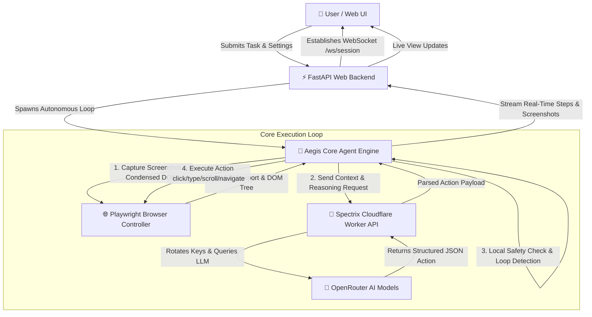
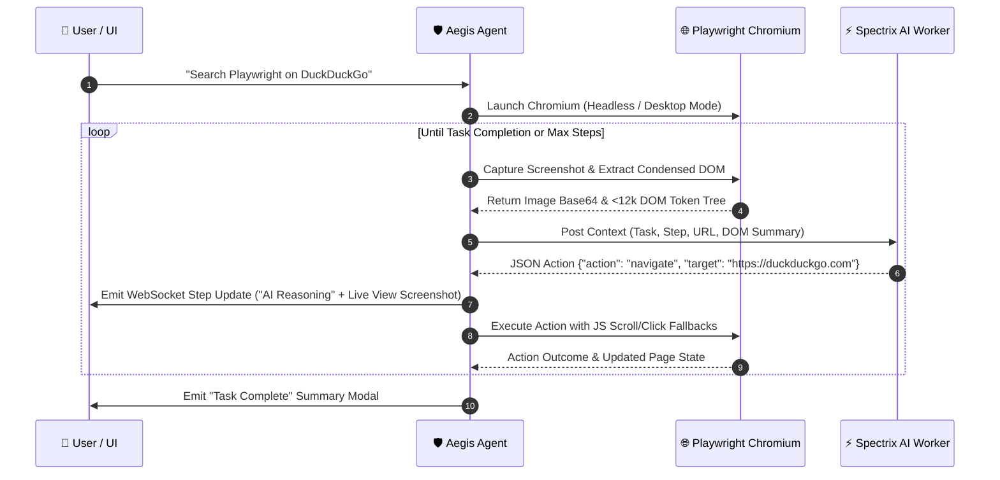

# 🛡️ Aegis — Autonomous AI Browser Agent

<p align="center">
  
  
  
  
  
</p>

---

> **The next-gen, zero-hesitation autonomous browser agent.**  
> Aegis blends **Playwright automation**, **Spectrix Cloudflare AI gateway**, **defensive DOM compression**, and a sleek **Chat + Live View UI** to execute complex web tasks completely autonomously. 🚀🔥

---

## ⚡ Key Highlights

- **💬 Chat-First Workspace**: Interactive dual-panel Chat UI with live reasoning bubbles, status badges (`DECIDING`, `EXECUTED`, `COMPLETE`), and quick-suggestion pills.
- **📺 Real-Time Live View**: Viewport stream that updates dynamically after every single action, keeping you in full sync with what the browser sees.
- **👁️ Visible Desktop vs Headless Mode**: Toggle between background headless execution or launching the physical, visible Chromium window on your screen.
- **⚡ Spectrix Cloudflare AI Worker Gateway**: High-throughput AI proxy with multi-key rotation, KV cooldown tracking, primary model `nvidia/nemotron-3-nano-omni-30b-a3b-reasoning:free`, and `google/gemma-4-31b-it:free` as the sole dedicated fallback.
- **🛡️ Deterministic Safety & Defensive Parsing**: Robust JSON parser utilizing `raw_decode` to bypass markdown wrapping, plus local safety classification for sensitive inputs and financial actions.
- **🔄 Anti-Stuck Loop Detection**: Automatically detects repeated actions (3x identical) or frozen page URLs (5x non-change) to prevent infinite loops.

---

## 🏗️ Architecture & Workflow



---

## 🔁 Agent Reasoning & Action Loop Sequence



---

## 🚀 Getting Started

### 1. Prerequisites
- **Python 3.10+**
- **Git**
- **Chromium / Playwright Dependencies**

### 2. Installation & Environment Setup

```bash
# Clone the repository
git clone https://github.com/taezeem14/Aegis.git
cd Aegis

# Create and activate virtual environment
python -m venv venv
# On Windows:
venv\Scripts\activate
# On Linux/macOS:
source venv/bin/activate

# Install dependencies
pip install -r requirements.txt

# Install Playwright browser binaries
playwright install chromium
```

---

## 🎮 Running Aegis

### 🌐 Option A: Web Portal (Recommended)
Start the FastAPI server and open the Chat + Live View Portal in your browser:

```bash
python -m uvicorn web.backend.app:app --host 127.0.0.1 --port 8000
```
Open **[http://127.0.0.1:8000](http://127.0.0.1:8000)** in Chrome/Edge to start chatting with Aegis!

---

### 💻 Option B: Command Line Interface (CLI)

Run single-shot tasks with live terminal streaming:

```bash
# Run a web automation task
python -m cli.main run "search playwright on duckduckgo" --max-steps 15

# Run in non-headless mode (opens physical browser on screen)
python -m cli.main run "go to wikipedia.org and search Quantum Computing" --no-headless

# View past session history logs
python -m cli.main history
```

---

## 🛠️ API & WebSocket Reference

### `POST /api/task`
Initiates an autonomous task session.

**Request Body:**
```json
{
  "task": "Search playwright on duckduckgo",
  "headless": true,
  "max_steps": 25
}
```
**Response:**
```json
{
  "session_id": "c3eb2cb9-c741-4437-a68d-5edf7a28c35e",
  "status": "started"
}
```

### `WebSocket /ws/{session_id}`
Establishes a real-time event stream for step updates, live view screenshots, and task completion summaries.

```json
{
  "type": "step_update",
  "data": {
    "session_id": "c3eb2cb9-c741-4437-a68d-5edf7a28c35e",
    "step_number": 1,
    "status": "executed",
    "message": "Executed: navigate",
    "screenshot": "iVBORw0KGgoAAAANSUhEUgAA...",
    "action": {
      "reasoning": "Navigating to DuckDuckGo search page",
      "action": "navigate",
      "target": "https://duckduckgo.com",
      "value": null,
      "is_destructive": false,
      "task_complete": false
    }
  }
}
```

---

## 🧪 Testing

Aegis includes a full suite of automated unit tests covering action validation, defensive parsing, safety classification, and agent loop execution:

```bash
# Run test suite
pytest
```

---

## ⚙️ Configuration (`config/settings.py`)

| Setting | Default Value | Description |
| :--- | :--- | :--- |
| `SPECTRIX_WORKER_URL` | `https://spectrix-worker.tariqmtaezeem.workers.dev/` | Cloudflare Worker AI API Endpoint |
| `AI_MODEL` | `nvidia/nemotron-3-nano-omni-30b-a3b-reasoning:free` | Primary LLM model slug |
| `FALLBACK_AI_MODEL` | `google/gemma-4-31b-it:free` | Sole fallback model slug |
| `ENABLE_SAFETY_CONFIRMATION` | `False` | Toggle for destructive action confirmation popups |
| `MAX_STEPS_DEFAULT` | `25` | Default safety step limit per task |
| `PLAYWRIGHT_BROWSERS_PATH` | `D:\playwright-browsers` | Custom Playwright installation path |

---

## 📄 License

Distributed under the **MIT License**. Created with 🔥 by **Muhammad Taezeem Tariq Matta**.
